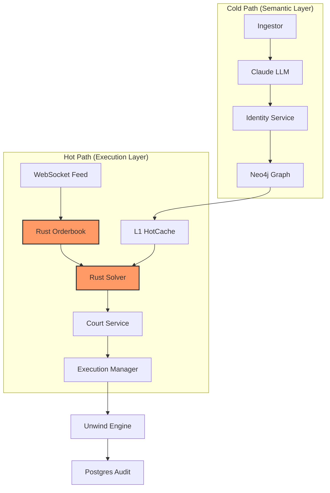

# 🛰️ PARALLAX: Hybrid HFT Arbitrage Engine

> **"Non-deterministic reasoning meets nanosecond execution."**

Parallax is an institutional-grade arbitrage platform for prediction markets (Polymarket, Kalshi). It solves the "semantic gap" between disparate venues using a high-performance **Hybrid Architecture**: a deterministic **Rust Core** for orderbook solving and an **AI-driven Cold Path** for identity resolution and logical proof generation.

---

## 💎 Institutional Grade Features

### ⚡ The Hot Path (Execution)
- **Rust-Native Core**: Sub-microsecond orderbook management and arbitrage detection via `parallax_core`.
- **Zero-Copy Serialization**: Powered by `msgspec` for ultra-fast Python-Rust bridging.
- **Nanosecond L1 Cache**: Pre-computed VWAP, spreads, and mid-prices available for immediate solving.

### 🧠 The Cold Path (Reasoning)
- **Identity v3**: Multi-gate semantic matching of cross-venue contracts with 0.85+ confidence thresholds.
- **Knowledge Graph**: Neo4j-backed persistence of market relations (Inversion, Equivalence, Inclusion).
- **Proof-of-Arbitrage (PoA)**: "No Proof, No Bet." Every trade requires a `TradeProofCertificate` validated by the Court Service.

### 🛡️ Safety & Resilience
- **Atomic Execution**: Pre-trade fund verification prevents unhedged or partial entry risk.
- **Stateful Unwind Engine**: Automated liquidation of "toxic flow" using real-time market depth.
- **Complexity Breaker**: Hard caps on MILP solver states to ensure deterministic response times.

---

## 🏗️ System Architecture



---

## 🚀 Performance Benchmarks

| Metric | Achievement | Technology |
| :--- | :--- | :--- |
| **Throughput** | **~75,000 ticks/s** | Rust Core + msgspec |
| **Latenza Hot Path** | **< 1μs** | BTreeMap (Rust) |
| **Startup Time** | **< 0.05s** (10k items) | Synchronous Binary I/O |
| **Max Concurrency** | **20+ Parallel Workers** | AnyIO TaskGroups |

---

## 🛠️ Developer Toolbox

We provide a suite of scripts for testing and performance validation:

- `make benchmark`: Measures the throughput of the replay pipeline.
- `scripts/stress_tester.py`: Spawns massive concurrent load to verify fund isolation and locking.
- `scripts/flash_crash_simulator.py`: Injects 20% price moves mid-execution to verify `UnwindEngine` resilience.
- `scripts/generate_mock_data.py`: Generates large-scale datasets for load testing.

---

## 🚦 Project Maturity

- [x] **Phase 1**: Concurrency & Infrastructure Audit
- [x] **Phase 2**: Core Logic & Financial Resilience
- [x] **Phase 3**: Performance & Rust Integration
- [x] **Phase 4**: Multi-Venue Stress Testing & Hardening
- [x] **Phase 5**: War Room Omega (Live Pilot Ready)

---

## 🏁 Getting Started

### 📦 Installation
```bash
make install   # Installs Python deps and compiles Rust core
make up        # Starts Docker infrastructure (PG, Neo4j)
make migrate   # Runs Alembic migrations
```

### 🎮 Running
```bash
# Launch the API and Semantic Discovery
make api

# Start the Real-time Pipeline (Dry Run)
make pipeline

# Open the War Room Dashboard
cd ui && npm install && npm run dev
```

---

## 🛡️ License
Distributed under the MIT License. See `LICENSE` for more information.
