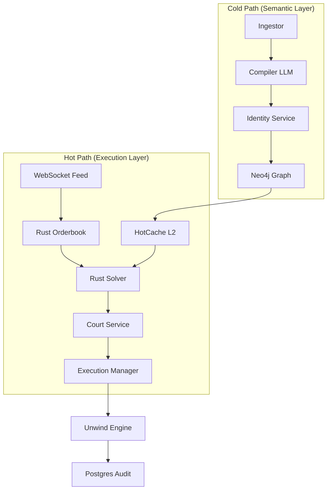

# 🛰️ Parallax: Hybrid HFT Arbitrage Engine

Parallax is a high-performance, institutional-grade arbitrage engine designed for prediction markets (Polymarket, Kalshi). It utilizes a unique **Hybrid Architecture** that separates high-latency semantic reasoning from ultra-low-latency execution.

[](https://opensource.org/licenses/MIT)
[](https://www.rust-lang.org/)
[](https://www.python.org/)

## 🚀 Key Features

- **Hybrid Hot/Cold Path**: Deterministic Rust core for nanosecond orderbook solving + Python/LLM for semantic relation discovery.
- **Semantic Arbitrage**: Discovers cross-venue opportunities (e.g., matching a Polymarket event with a Kalshi contract) using SentenceTransformers and LLMs.
- **Proof-of-Arbitrage (PoA)**: "No Proof, No Bet" philosophy. Every trade requires a `TradeProofCertificate` generated by a multi-gate `CourtService`.
- **Stateful Risk Management**: Persistent `HedgeIntent` state machine ensures delta-neutrality even through process crashes.
- **Institutional Persistence**: Tiered L1/L2/L3 cache (Dict/SHM/Aerospike) and comprehensive audit logging.
- **War Room UI**: Real-time React dashboard for monitoring execution, proofs, and graph relations.

## 🏗️ Architecture



## 🛠️ Quick Start

### Prerequisites
- Python 3.12+ (managed via `uv`)
- Rust (for the core extension)
- Docker (for Postgres, Neo4j, Aerospike)

### Installation
```bash
make install   # Installs Python deps and compiles Rust core
make up        # Starts infrastructure
make migrate   # Runs Alembic migrations
```

### Running the Engine
```bash
# Start the API and Semantic Loop
make api

# Start the Real-time Pipeline (Dry Run)
make pipeline

# Launch the War Room (UI)
cd ui && npm install && npm run dev
```

## 📜 Core Commands

| Command | Description |
| --- | --- |
| `make test` | Run the full test suite (350+ tests) |
| `make pipeline` | Execute a logical arbitrage scan |
| `make proof` | Generate a `TradeProofCertificate` bundle |
| `make migrate` | Update database schema |

## 🛡️ Safety & Risk

Parallax is designed with a **Safety-First** mindset:
- **Dry Run by Default**: `RUNTIME_LIVE_EXECUTION_ENABLED=false`.
- **Circuit Breakers**: Automatic pause on daily loss limits or excessive exposure.
- **Stateful Hedging**: The `UnwindEngine` tracks every partial fill in the `hedge_intents` table for guaranteed recovery.

## 📄 Documentation

- [Architecture Overview](docs/ARCHITECTURE.md)
- [Operator Runbook](docs/RUNBOOK.md)
- [API Reference](docs/API.md)
- [Contributing Guide](CONTRIBUTING.md)

## ⚖️ License

Distributed under the MIT License. See `LICENSE` for more information.
